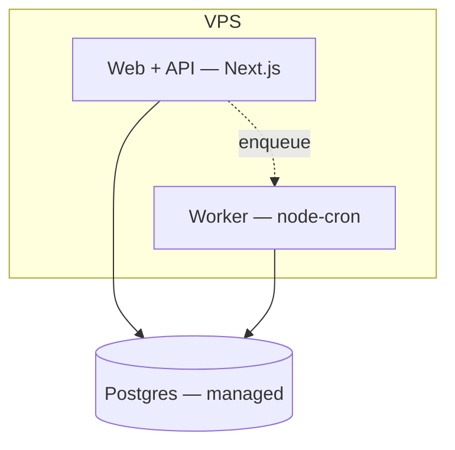
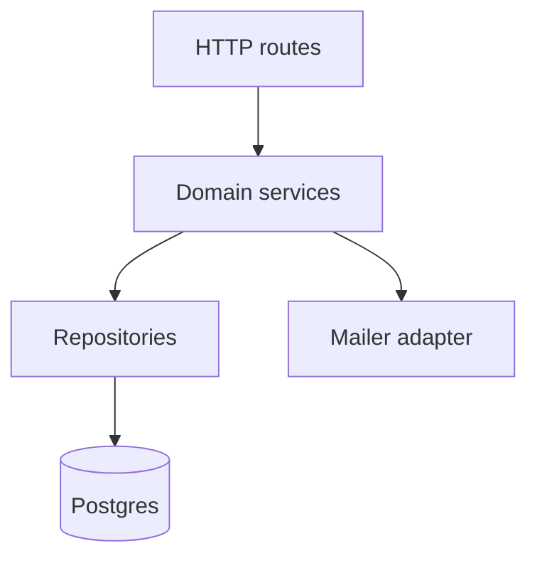
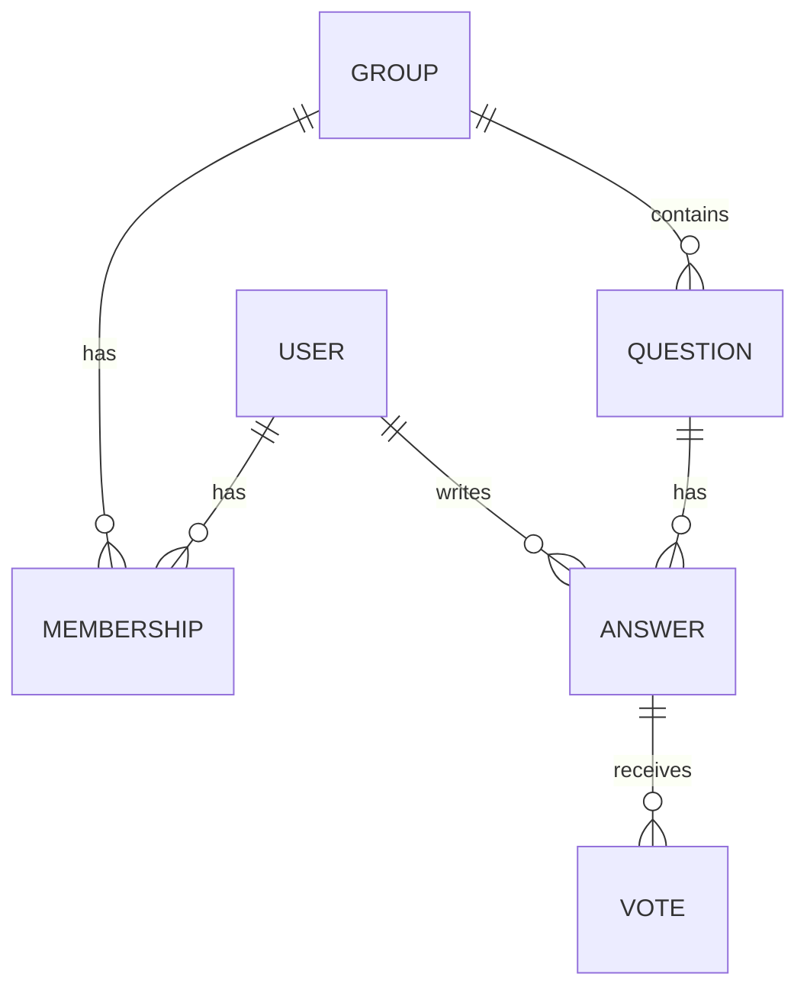
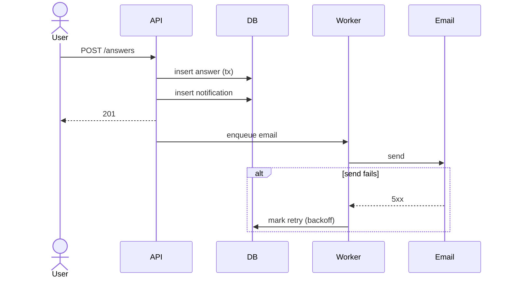
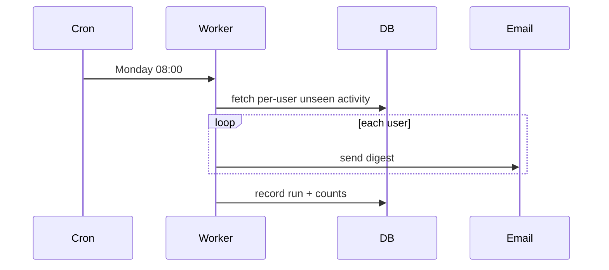

# System Design — {{PROJECT}}

_Describes the intended system as of {{DATE}}. Pairs with docs/REQUIREMENTS.md._
_Author: {{name}} · Reviewers: {{names}} · Status: Draft / Approved_

---

## 1. Overview

{{3–5 sentences: what the system does, the architecture style chosen, and the
2–3 headline technology choices. A reader should get the shape from this alone.}}

## 2. Context (C4 Level 1)

```mermaid
flowchart LR
  user([Student]) --> sys[{{PROJECT}}]
  admin([Admin]) --> sys
  sys --> email[[Email provider]]
  sys --> storage[[Object storage]]
```

| External entity | Why it's involved | Interface |
|---|---|---|
| {{Email provider}} | {{transactional + digest email}} | {{SMTP/API}} |

## 3. Architecture drivers

The requirements/constraints that most shape this design.

| # | Driver (from REQUIREMENTS) | Architectural implication |
|---|---|---|
| D1 | {{Budget < $30/mo, solo dev}} | {{minimise moving parts → modular monolith, managed DB}} |
| D2 | {{GDPR delete-my-data}} | {{single owner per PII entity; hard-delete path}} |
| D3 | {{p95 < 400ms at 300 RPS}} | {{cache hot reads; index hot query paths}} |

## 4. Solution approach & alternatives

**Chosen:** {{modular monolith — one deployable Next.js app + Postgres + in-process
cron worker}}. Justified by D1, D{{x}}.

| Alternative | Why rejected |
|---|---|
| {{Microservices}} | {{ops + infra cost violates D1; no scale need}} |
| {{BaaS only (Supabase/Firebase)}} | {{digest job + custom ranking awkward; lock-in}} |

## 5. Containers (C4 Level 2)



| Container | Responsibility | Tech | Scaling | Talks to (protocol) |
|---|---|---|---|---|
| {{Web/API}} | {{UI, REST API, auth}} | {{Next.js 14}} | {{vertical; add instances behind LB later}} | {{Postgres (SQL), Worker (queue table)}} |
| {{Worker}} | {{digest job, email retries}} | {{Node + node-cron}} | {{single instance, idempotent jobs}} | {{Postgres}} |
| {{Postgres}} | {{system of record}} | {{PG 16 managed}} | {{tier upgrade; read replica later}} | — |

## 6. Components (C4 Level 3)

### {{Web/API}} container



| Component | Responsibility |
|---|---|
| {{Routes}} | {{HTTP parsing, auth guard, validation, response shaping}} |
| {{Domain services}} | {{business rules, transactions}} |
| {{Repositories}} | {{SQL, mapping}} |
| {{Adapters}} | {{email, storage, external APIs}} |

## 7. Data model



| Entity | Key fields (type) | Keys | Owned by | Retention |
|---|---|---|---|---|
| {{User}} | {{id uuid, email citext, name text, password_hash text, created_at ts}} | {{PK id, UNIQUE email}} | {{auth}} | {{until delete-me}} |
| {{Question}} | {{id, group_id fk, author_id fk, title, body, created_at}} | {{PK id; INDEX (group_id, created_at desc)}} | {{qa}} | {{lifetime}} |

**Hot paths:** {{list group questions — indexed on (group_id, created_at); vote
counts — denormalised counter column updated in tx.}}

**Migrations:** {{tool, forward-only, one file per change, run in CI + on deploy.}}

## 8. API design

- **Style:** {{REST/JSON}} · **Auth:** {{HTTP-only session cookie, CSRF token}}
- **Versioning:** {{/api/v1; additive changes only within a version}}
- **Errors:** {{RFC 7807 problem+json — type, title, status, detail}}
- **Pagination:** {{opaque cursor, `?cursor=&limit=` , max 50}}
- **Idempotency:** {{`Idempotency-Key` header on POSTs that create}}

| Operation | Method / path | Request | Response | Notes |
|---|---|---|---|---|
| {{Create question}} | {{POST /api/v1/groups/:id/questions}} | {{{title, body}}} | {{201 Question}} | {{member only, rate-limited}} |
| {{List questions}} | {{GET /api/v1/groups/:id/questions}} | {{cursor, limit}} | {{{items, nextCursor}}} | |

**External events / webhooks:** {{email provider bounce webhook → mark address}}

## 9. Key flows

### {{Post answer & notify}}



### {{Weekly digest job}}


## 10. Cross-cutting concerns / NFRs

### 10.1 Security & privacy
- **AuthN:** {{Argon2id hashes, session cookie, 30-day sliding expiry}}
- **AuthZ:** {{role + group-membership checks in services, not routes}}
- **Secrets:** {{env vars via host secret store; never in repo; gitleaks in CI}}
- **Data protection:** {{TLS everywhere; PII columns documented; backups encrypted}}
- **Threats & mitigations:** {{XSS→output encoding + CSP; CSRF→token; SQLi→
  parameterised; brute force→rate limit + lockout; IDOR→ownership checks}}
- **Supply chain:** {{lockfile, Dependabot, `npm audit` gate, pinned CI actions}}
- **GDPR:** {{`/account/export` returns all user data; `/account/delete` hard-
  deletes or anonymises within 30 days}}

### 10.2 Performance & scalability
- **Targets:** {{p95 < 400ms @ 300 RPS}}
- **Bottlenecks:** {{question list query, vote writes}}
- **Tactics:** {{covering index; HTTP cache on public reads; counter column for
  votes; connection pool sized to DB tier; N+1 guard in repo layer}}
- **Scale path:** {{add web instances behind LB → read replica → partition by group}}

### 10.3 Reliability & availability
- **Target:** {{99.5%/mo}}
- **Failure modes:** {{DB down → 503 + retry-after; email down → queue + backoff;
  worker crash → jobs idempotent, resume on restart}}
- **Backups:** {{nightly pg_dump to object storage, 30-day retention, monthly
  restore test}}
- **DR:** {{RPO 24h, RTO 4h — recreate host from IaC, restore latest dump}}

### 10.4 Observability
- **Logs:** {{structured JSON (pino), request id, no PII in logs}}
- **Metrics:** {{/metrics — RPS, latency histogram, error rate, queue depth, job
  duration}}
- **Traces:** {{optional OTel later}}
- **Dashboards:** {{"Service health", "Digest job"}}
- **Alerts:** {{uptime check; error rate > 2% 5m; queue depth > 500; job failed}}

### 10.5 Accessibility & i18n
- {{WCAG 2.1 AA via ui-scaffold baseline; copy externalised for future i18n}}

### 10.6 Cost
| Item | Monthly |
|---|---|
| {{VPS}} | {{$6}} |
| {{Managed Postgres}} | {{$7}} |
| {{Email (10k/mo free tier)}} | {{$0}} |
| {{Object storage + backups}} | {{$1}} |
| {{Uptime/monitoring}} | {{$0}} |
| **Total** | **{{~$14}}** (ceiling $30) |

## 11. Deployment & environments

| Env | Purpose | Data | Deploy trigger |
|---|---|---|---|
| local | dev | seed/fixtures | — |
| staging | pre-prod verify | anonymised | merge to `main` |
| production | live | real | tag `v*` / manual approve |

- **Infra as code:** {{Terraform / Docker Compose / host config committed}}
- **CI/CD gates:** {{lint, typecheck, test, build, secret-scan (see cicd-setup)}}
- **Release strategy:** {{rolling; migrations backward-compatible; feature flags
  for risky changes}}
- **Rollback:** {{redeploy previous image; migrations are expand/contract}}

## 12. Tech stack

| Layer | Choice | Why (driver) | Maturity / risk |
|---|---|---|---|
| Language | {{TypeScript}} | {{team skill (D-team); type safety}} | low |
| App framework | {{Next.js 14}} | {{one deployable, SSR+API (D1)}} | low |
| DB | {{PostgreSQL 16}} | {{relational data, cheap managed tier (D1)}} | low |
| ORM/queries | {{Drizzle / Prisma / SQL}} | {{migrations, type-safe}} | low |
| Auth | {{home-grown sessions / Auth.js}} | {{simple model (REQ)}} | med |
| Email | {{Resend / SES}} | {{free tier covers volume (D1)}} | low |
| Hosting | {{Fly.io / Hetzner VPS}} | {{cost (D1)}} | low |

## 13. Risks & mitigations

| # | Risk | Likelihood | Impact | Mitigation |
|---|---|---|---|---|
| R1 | {{solo dev bus factor}} | med | high | {{docs current, IaC, small stack}} |
| R2 | {{digest email volume spikes cost}} | low | med | {{batch, monitor, cap}} |

## 14. Decision log

- ADR-0001 — {{Modular monolith over services}}
- ADR-0002 — {{PostgreSQL as system of record}}
- ADR-000x — {{...}}

(Write these in `docs/adr/` using project-docs' ADR template.)

## 15. Glossary

| Term | Meaning |
|---|---|
| {{Group}} | {{a study cohort; membership-gated}} |
