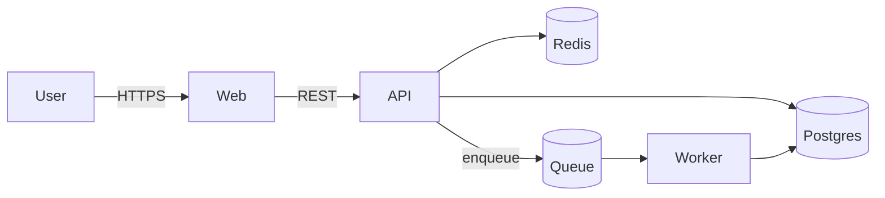

# Architecture

_Describes the system as it IS on {{DATE}}. Aspirations go under "Planned"._

## Overview

{{2–4 sentences: what the system does and its top-level shape.}}

## Components

| Component | Responsibility | Tech | Location |
|---|---|---|---|
| {{Web app}} | {{UI + SSR}} | {{Next.js}} | `apps/web` |
| {{API}} | {{business logic}} | {{...}} | `apps/api` |
| {{Worker}} | {{async jobs}} | {{...}} | `apps/worker` |

## Data flow

## Data stores

| Store | Purpose | Notes |
|---|---|---|
| {{Postgres}} | {{primary data}} | {{migrations in `db/migrations`}} |

## External services

| Service | Used for | Failure mode |
|---|---|---|
| {{Stripe}} | {{billing}} | {{degrade to read-only}} |

## Key constraints & decisions

- {{constraint}} — see ADR-{{NNNN}}

## Planned (not yet built)

- {{future component / change}}
